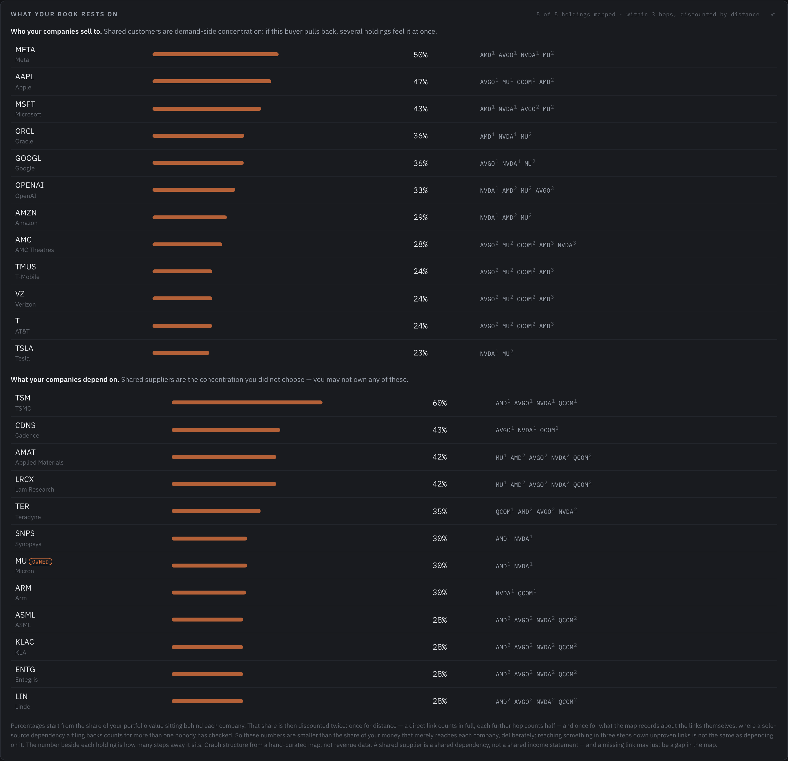
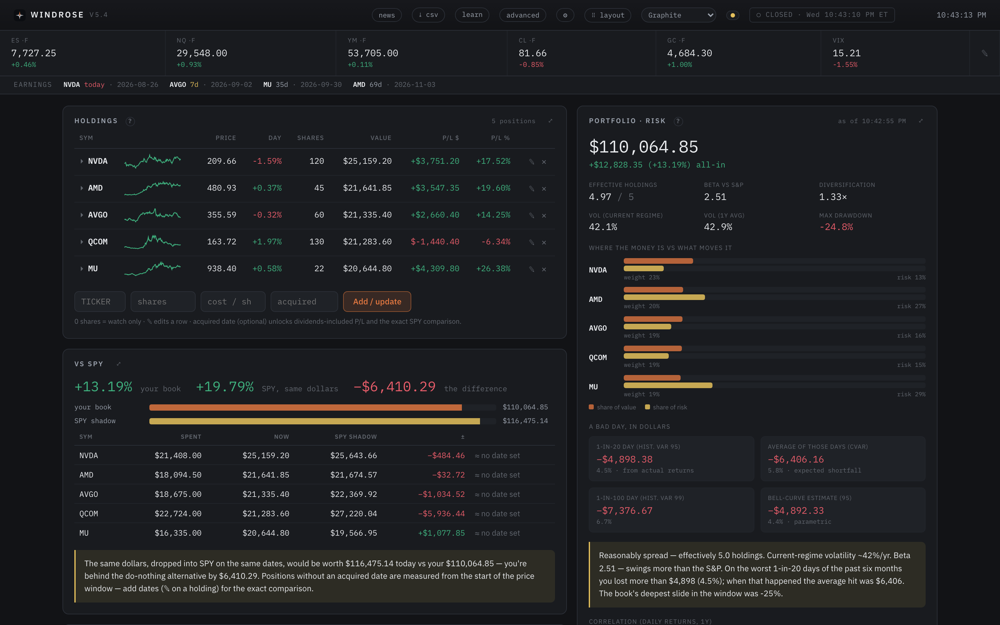
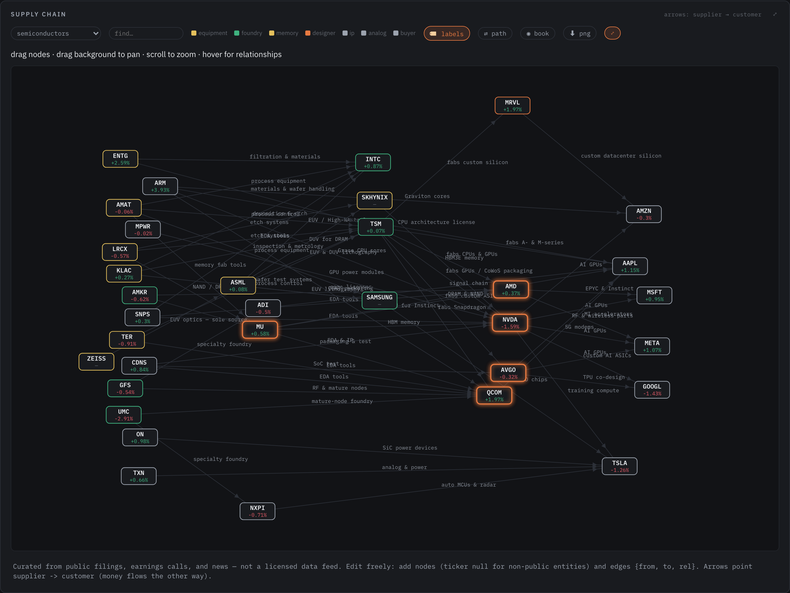
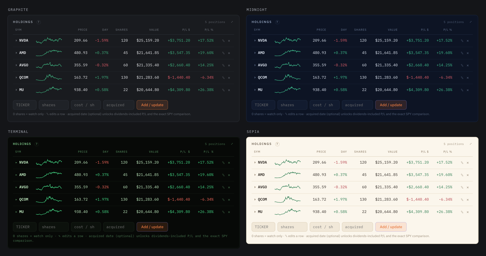

# Windrose

A local, read-only investing console you run on your own machine. Your holdings
live in a file on your disk, the dashboard renders in your browser, and nothing
ever leaves your computer except the price requests it makes on your behalf.

It is deliberately **view-only**. Windrose cannot place a trade, and it never
tells you what to buy. It shows you what you own, how it actually behaves
together, and where it sits in the wider economy — then gets out of the way.



Five holdings, five tickers, one industry — and underneath them, companies
nobody in the book owns. Once each link is discounted for distance and for what
the map can actually show about it, 60% of this book's value sits behind TSMC,
with Cadence, Applied Materials and Lam Research behind it. Correlation only
tells you that after it has cost you something.

Stuck, or something looks wrong? [Open an issue](https://github.com/Shaw54-eagle/windrose/issues),
or use **Report a problem** in Settings (⚙) — it fills in your version and
platform for you, and never includes your holdings, keys or notes.

## Start it

Get the folder, then **double-click one file**:

| Your computer | Double-click |
| --- | --- |
| Mac | **RUN-ME-mac.command** |
| Windows | **RUN-ME-windows.bat** |

That is the whole thing. It sets itself up the first time (a minute or two),
starts the dashboard, and opens your browser. After that it just starts. To
stop it, close the window it opened.

You need **Python 3.10 or newer** — [python.org/downloads](https://www.python.org/downloads/).
If it is missing, the launcher tells you so in plain language rather than
failing at you. **On Windows, tick "Add python.exe to PATH"** on the installer's
first screen; it is off by default, it is easy to miss, and nothing works
without it.

### Two things that catch people out

**Mac: double-clicking does nothing.** GitHub's *Download ZIP* strips the
permission that makes a file runnable. Open Terminal, type `chmod +x ` (with a
space), drag `RUN-ME-mac.command` into the window, press Return, then
double-click it again. Installing with `git clone` avoids this entirely.

**Mac: "cannot be opened because it is from an unidentified developer."** That
is Gatekeeper, and it is expected — the file is not signed with an Apple
developer certificate. Right-click (or Control-click) the file, choose **Open**,
then **Open** again in the dialog. Once only.

On Windows, SmartScreen may show a blue "Windows protected your PC" box for the
same reason: click **More info**, then **Run anyway**.

### If you prefer a terminal

```
git clone https://github.com/Shaw54-eagle/windrose.git
cd windrose
bash setup.sh
bash start.sh
```

Also here: `Setup Windrose.command` and `Start Windrose.command` on macOS,
`start.bat` on Windows. The RUN-ME files just wrap these with a friendlier
first-run check — they run the same code.

Whichever route you take, it opens **http://127.0.0.1:7070** (http, not https —
it's a local server) and a four-step wizard takes it from there: pick Simple or
Advanced, optionally add API keys (it tests them before saving), choose whether
to start empty or with an example book, and go.

Cloning rather than downloading a zip is worth it — only a clone can tell you
when a new version is published, and taking it is then one `git pull`. It also
sidesteps the `chmod` problem above.

**No API keys are required.** Out of the box Windrose runs on delayed Yahoo
Finance quotes and every panel works. Two free keys unlock extras, and the setup
wizard will test a key against the real API before it saves it — so you find out
immediately if you pasted the wrong thing:

| Key | What it adds | Where |
| --- | --- | --- |
| Finnhub | News headlines, analyst outlook | https://finnhub.io/register |
| Alpaca | Live ~2 second prices (paper keys work fine) | https://app.alpaca.markets |

---

## What's in it



**Holdings** — live prices, day moves, P/L against your cost. Zero shares means
watch-only: full analysis, no effect on portfolio math. Add an acquired date and
it unlocks dividend-included returns and an exact index comparison.

**Portfolio risk** — the panel that earns its keep. Not what you own, but how it
behaves as a whole: effective number of independent holdings, beta, volatility,
max drawdown, historical and parametric VaR, expected shortfall, and paired bars
showing each position's share of your *money* against its share of your *risk*.
Those two numbers are rarely the same, which is usually the point.

**vs SPY** — the same dollars, on the same dates, dropped into the index
instead. The one benchmark that can't be argued with.

**Supply chain map** — 26 industries, ~430 companies, ~525 hand-curated
relationships, laid out left to right from first producer to end customer, with
a live quote on every public node.

- `all` fuses every industry into one economy-wide graph
- click (or hover) any company for a card: price, 30-day sparkline, sector,
  market cap, its key relationships, and buttons to analyze or watch it
- `⇄ path` traces the shortest supply route between any two companies —
  Lockheed to Netflix is six hops
- `◉ book` lights up everything your holdings touch, with a 1/2/3-hop dial
- `🏷 labels` paints the relationships onto the map; `⬇ png` exports the view
- double-click a node to isolate its world, with supplier-only and
  customer-only views; right-click adds a company to your watchlist
- drag anything — your arrangement is remembered per industry



**Workbench** — reverse DCF, comparables, three-statement summary, a paper LBO,
merger math, Monte Carlo, historical stress replays, and a strategy lab. Every
assumption is a visible slider. Nothing is hidden in the code.

**Alerts** — price levels, day moves, RSI extremes, moving-average crosses,
drawdown. Each rule fires once when crossed, then re-arms when the condition
clears.

**Decision journal** — write down *why* before you act. Entries are marked to
market with a running hit rate, and an honest note that a handful of decisions
is noise, not skill.

Plus: an editable ticker strip that follows you down the page, per-holding news
dropdowns, a drag-anywhere panel layout, five layout presets, CSV export, and a
guided tour on first run.

**Themes** — six, plus an Auto setting that follows your system between light
and dark, and a separate colour-blind safe toggle that swaps gain/loss green and
red for blue and orange. The same panel in four of them:



---

## What your book rests on

The risk panel measures how your holdings move *together*. This panel measures
what they **depend on** — which correlation only reveals after it has cost you
something.

It walks the supply-chain map outward from each holding and reports every
company two or more of them reach, weighted by how much of your portfolio value
sits behind it. Both directions matter:

- **Downstream — who your companies sell to.** Shared customers are demand-side
  concentration. A defence-heavy book can show a single buyer behind 100% of its
  value while its beta reads as calm.
- **Upstream — what your companies depend on.** Shared suppliers are the
  concentration you never chose. You often own none of them.

Read it carefully, because it is structure, not revenue. A company appearing
behind 70% of your book means the things you own sit downstream of it — not
that 70% of your money depends on it. Hops are graph distance, not importance:
this cannot tell a sole-source supplier from a commodity vendor. And the map is
hand-curated, so a missing link may be a gap rather than independence.

If nothing is shared, that is a real result too — structurally, that is what
diversification looks like.

## One panel at a time

Every panel header has a `⤢`. Click it and that panel becomes the only thing on
screen, filling the window. Shrink the browser window afterwards and you have a
small tile — Alerts, say, or Holdings — to park in a corner while you work.
`Esc` or **← all panels** brings the dashboard back, and the choice survives a
reload so you can park it once and forget it.

## Alerts and notifications

Alerts fire in the browser on **macOS, Windows and Linux** — it's the standard
Web Notifications API, so Chrome, Edge, Firefox and Safari all behave the same.
Click **Enable desktop notifications** in the Alerts panel once and allow the
prompt. If you previously blocked them, the panel tells you where to undo that
for your specific browser, because browsers never re-prompt once denied.

Windrose also notifies through the operating system itself when no tab is open
(`osascript` on macOS, toast notifications on Windows, `notify-send` on Linux).
That's opt-out: set `"desktop_notifications": false` in `settings.json`.

## Keeping it running

Alerts are evaluated by the server, so they only fire while Windrose is
running — close the window or sleep the machine and nothing is watching. The
Alerts panel says so plainly, because an alert you believe in but never get is
worse than no alert at all.

To keep it up, run **Run at Login** in the Windrose folder. On macOS it installs
a LaunchAgent, on Linux a `systemd --user` service; both start Windrose quietly
at login and restart it if it dies. Run it again to remove it. On Windows, use
Task Scheduler:

```
schtasks /create /tn Windrose /sc onlogon /tr "'%CD%\venv\Scripts\pythonw.exe' '%CD%\app.py'"
```

Neither approach can run while the computer is off, or wake a sleeping one.
Alerts resume when it wakes.

## A quiet console

Windrose polls itself a few times a second, and Flask logs every request, so
the terminal used to scroll constantly and bury anything that mattered. The
request log is off by default; genuine errors still print. Set
`WINDROSE_VERBOSE=1` to see everything.

## If port 7070 is taken

Windrose serves on 7070 by default. If something else already owns it — common
on a machine that runs other services — start it somewhere else:

```
WINDROSE_PORT=7071 bash start.sh
```

then open `http://127.0.0.1:7071`. The launchers and the browser-open follow
the same variable. On Linux, `ss -ltnp | grep 7070` shows what is holding it;
if no process name appears, it belongs to another user and needs `sudo` to see.

## Checking your install

Something behaving oddly? Ask the app to diagnose itself:

```
./venv/bin/python selftest.py            # offline checks
./venv/bin/python selftest.py --online   # also verifies live data and the map
```

It reports Python and dependency health, whether your keys are being read (never
the keys themselves), whether your data files are valid JSON, and whether the
supply-chain map is internally consistent — dangling edges, duplicate nodes,
companies with no relationships. With `--online` it also confirms quotes are
flowing, checks for updates, and verifies every mapped ticker still resolves,
which is how acquisitions and renames get caught.

Nothing in the report identifies you or your positions, so it is safe to paste
into an issue.

## A note on contributed map data

`supply_chain.json` is community-editable, which makes its contents untrusted
input. Company labels and relationship text are stripped of HTML when the file
is loaded, and escaped again when rendered. Both locks exist because a crafted
label was once able to run arbitrary JavaScript in the dashboard — with access
to the local API that holds your positions. Please keep both in place if you
fork this.

Ticker symbols entered anywhere are validated against a strict pattern, and
share counts and costs must be non-negative and finite.

Working on the code? `CLAUDE.md` holds the project conventions,
the security rules and the reasons behind them.

## Feedback and contributing

Found a bug or want something added? [Open an issue](https://github.com/Shaw54-eagle/windrose/issues).
There's a **Report a problem** button in Settings (⚙) that opens one with your
version and platform already filled in — it never includes your holdings, keys,
or journal.

Pull requests are welcome, especially for `supply_chain.json`: corrections to
relationships, missing suppliers, whole industries that aren't mapped yet. The
format is documented above and the file is plain JSON.

## Updates

**Windrose tells you about updates. It does not install them.**

If you installed with `git clone`, each launch fetches the published version and
compares. If something newer exists it prints the version number and stops there:

```
  Windrose 5.4 is available. You are on 5.3.
  Nothing has been changed — Windrose no longer updates itself.

      git pull
```

You update by running that, when you want to. Until then you stay exactly where
you are.

This used to fast-forward automatically, and it was the wrong default. An
auto-applying updater means whatever is on `main` runs on your machine without
you agreeing to it — including a mistake pushed at midnight. Checking is useful.
Applying was never ours to decide.

The rules the check will not break:

- **it never writes.** No merge, no rebase, no reset, no checkout. It reads.
- **your edits win.** Uncommitted changes to tracked files and it stays quiet
  entirely. Extending `supply_chain.json` will not get you nagged.
- **diverged history stops it.** It says so and does nothing else.
- **failure is harmless.** Offline, unreachable, or anything unexpected — the
  app just starts on the version you have.

The header shows an `↑ v5.4` pill when something newer is published. It has
always been notify-only and is unchanged.

To skip the check entirely, set `"auto_update": false` in `settings.json`, or
launch with `WINDROSE_NO_UPDATE=1`. That setting used to mean "don't apply
updates" and now means "don't look" — if you had it off, you are still left
alone.

Installed from a zip instead of a clone? Nothing is downloaded automatically —
the pill links you to the repo so you can grab it yourself.

## Your data

Windrose stores everything in plain files next to the code:

| File | What | Committed? |
| --- | --- | --- |
| `holdings.json` | Your positions | No — git-ignored |
| `journal.json` | Your decision log | No — git-ignored |
| `alerts.json` | Your alert rules | No — git-ignored |
| `.env` | Your API keys | No — git-ignored |
| `.lan_pin` | Your phone-access passcode | No — git-ignored |
| `supply_chain.json` | The industry map | Yes — it's shared data |

A fresh install opens with a five-stock **example portfolio** (Apple, JPMorgan,
Exxon, Coca-Cola, UnitedHealth) so the dashboard has something to show on the
first run. They are placeholders, not recommendations — delete any row with the
✕ and add your own. The first launch creates the files it
needs. Layout and map arrangements are stored in your browser, so each browser
keeps its own setup.

If you fork this, double-check `git status` before your first commit — the
`.gitignore` is doing real work.

---

## On your phone

Windrose runs on your computer; your phone views it over your own Wi-Fi. There is
no cloud account and nothing is hosted anywhere.

1. On the computer, start it in phone mode:
   - macOS: double-click **Phone Access.command**
   - Linux / Windows: `bash start.sh --lan` (or `python app.py --lan`)
2. The terminal prints an address, a **passcode**, and a QR code. Scan the QR
   with your phone camera, or type the address into Safari and enter the code.
3. In Safari, tap **Share → Add to Home Screen**. Windrose then opens full-screen
   with its own icon, no browser chrome — it behaves like an installed app.

The phone layout is built for touch: panels stack into one column, the ticker
strip swipes sideways, and on the supply-chain map you **drag** nodes with one
finger, **pinch** to zoom, **tap** a company for its card, **double-tap** to
isolate its world, and **long-press** to add it to your watchlist.

Two things worth knowing. The computer has to stay awake with Windrose
running — the phone is only a window onto it. And phone access opens a port on
the network you are joined to, which is why it is passcode-protected and off by
default: use it on your home Wi-Fi, not in a café.

| How you start it | Listens on | Who can reach it |
| --- | --- | --- |
| normal launch | `127.0.0.1` | Nothing outside this computer |
| phone access (`--lan`) | all interfaces | Anything on your Wi-Fi, passcode required |

A dedicated phone app is planned separately.

---

## Desktop app mode (macOS)

`Windrose.app` in this folder opens the dashboard on double-click. Run
`Enable App Mode.command` once and it installs [pywebview](https://pywebview.flowrl.com/),
after which `Windrose.app` opens in its own native window instead of a browser
tab — dock icon and all.

---

## Extending the supply chain map

`supply_chain.json` is plain, readable JSON and pull requests are welcome:

```json
{
  "networks": {
    "your-industry": {
      "nodes": [
        { "id": "AAPL", "label": "Apple", "type": "buyer" },
        { "id": "PRIVATECO", "label": "Some Private Co", "type": "supplier", "ticker": null }
      ],
      "edges": [
        { "from": "PRIVATECO", "to": "AAPL", "rel": "what they actually sell them" }
      ]
    }
  }
}
```

`id` doubles as the ticker unless you set `ticker: null` for private companies,
agencies, or customer groups. Arrows point **supplier → customer** (money flows
the other way). `type` drives the color legend. Restart to pick up changes.

The map is curated from public filings, earnings calls, and news. It is not a
licensed data feed, and it is certainly incomplete — corrections welcome.

---

## Requirements

Python 3.10+ and an internet connection. Dependencies (Flask, pandas, numpy,
yfinance, requests, websocket-client) install into a `venv/` folder inside this
directory — nothing touches your system Python.

## Disclaimer

Windrose is a personal research tool, not investment advice, and not a broker. The
numbers come from free public data sources that are sometimes delayed, revised,
or simply wrong. Every model here is an assumption engine — change an input and
the answer changes. Verify anything you plan to act on. You are responsible for
your own decisions.

## License

MIT — see [LICENSE](LICENSE).
